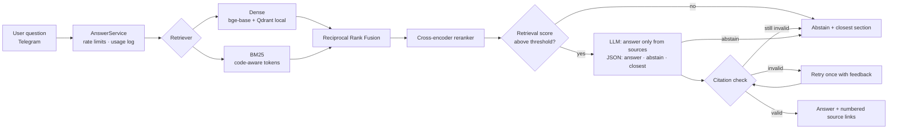

# Uniswap Docs Assistant — an evaluated, hallucination-aware RAG bot

Ask a question about the Uniswap developer docs in Telegram and get a short answer with
links to the exact doc sections it came from. If the docs don't cover the question, it
says so and points you to the closest section instead of guessing.

The point of this repo is the evidence: every quality number below comes from a
reproducible evaluation harness, and the same pipeline can be pointed at another
protocol's docs by changing one config file.

**Live demo:** TODO (Telegram link) · **Demo video:** TODO

## Results

TODO: two-sentence summary written from the final run.

<!-- results:start (generated by `rag report --update-readme`; do not edit) -->
_Not yet generated: run `rag eval`, then `rag report <run-dir> --update-readme`._
<!-- results:end -->

How to read it:
- **Hallucination rate** = share of atomic claims in answers that the judge could not find
  in the retrieved context (lower is better).
- **Correct abstention** = on questions the docs don't answer, how often the bot declines.
  **False abstention** = on answerable questions, how often it wrongly declines.
- **Citation validity** = answers whose every cited source was actually retrieved and every
  factual sentence carries a citation.
- Brackets are 95% bootstrap confidence intervals. Raw per-question outputs for every
  number are in `eval/runs/`.

## How it works



Ingestion: pinned docs snapshot (`git` commit + sha256 manifest) → MDX normalised to
Markdown → structure-aware chunks (never split inside code blocks or tables) → cached
embeddings → Qdrant (embedded mode) + BM25.

## Run it

Requirements: Python 3.11+, [uv](https://docs.astral.sh/uv/), a free
[Groq](https://console.groq.com) API key; Telegram bot token for the bot.

```bash
uv sync
cp .env.example .env     # add GROQ_API_KEY (and TELEGRAM_BOT_TOKEN for the bot)
uv run rag fetch         # download the pinned docs snapshot + manifest
uv run rag ingest        # chunk, embed (cached), build indexes
uv run rag eval          # full evaluation, resumable; writes eval/runs/<run>/results.md
uv run rag bot           # start the Telegram bot
```

Deployment on a VPS with Docker: [docs/deploy.md](docs/deploy.md).

Point it at another protocol: copy `config/uniswap.yaml`, change the `corpus` block (repo,
commit, folders, published URL pattern) and `generation.protocol_name`, then run with
`--config config/<protocol>.yaml`.

## Design decisions

TODO: written from the final results (chunking, hybrid vs dense, reranker, abstention, what
did not work).

## Limitations

TODO: judge limitations and agreement rate from the human spot check.

## Repository map

| Path | What |
|---|---|
| `src/docrag/ingest/` | MDX normalisation, structure-aware chunker |
| `src/docrag/retrieval/` | embedder + cache, Qdrant store, BM25, RRF, reranker, retriever |
| `src/docrag/generation/` | prompt, citation checker, assistant (abstention logic) |
| `src/docrag/eval/` | question set, drafting, judge, runner, metrics, report |
| `src/docrag/service.py`, `src/docrag/bot/` | transport-agnostic service, Telegram adapter |
| `prompts/` | versioned prompt templates (answer, judge) |
| `config/uniswap.yaml` | corpus + pipeline configuration |
| `eval/questions.jsonl` | the evaluation set (dev / test splits) |
| `eval/runs/` | raw outputs of every evaluation run |
| `docs/experiments/` | chunk-size and retrieval experiments |
