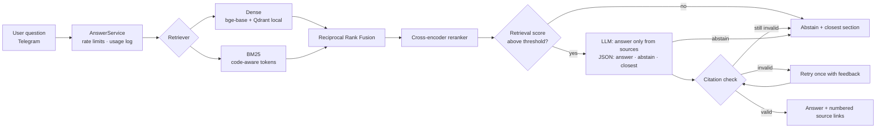

# Uniswap Docs Assistant — an evaluated, hallucination-aware RAG bot

Ask a question about the Uniswap developer docs in Telegram and get a short answer with
links to the exact doc sections it came from. If the docs don't cover the question, it
says so and points you to the closest section instead of guessing.

The point of this repo is the evidence: every quality number below comes from a
reproducible evaluation harness, and the same pipeline can be pointed at another
protocol's docs by changing one config file.

**Live demo:** TODO (Telegram link) · **Demo video:** TODO

## Results

TODO: two-sentence summary written from the final run.

<!-- results:start (generated by `rag report --update-readme`; do not edit) -->
_Not yet generated: run `rag eval`, then `rag report <run-dir> --update-readme`._
<!-- results:end -->

How to read it:
- **Hallucination rate** = share of atomic claims in answers that the judge could not find
  in the retrieved context (lower is better).
- **Correct abstention** = on questions the docs don't answer, how often the bot declines.
  **False abstention** = on answerable questions, how often it wrongly declines.
- **Citation validity** = answers whose every cited source was actually retrieved and every
  factual sentence carries a citation.
- Brackets are 95% bootstrap confidence intervals. Raw per-question outputs for every
  number are in `eval/runs/`.

## How it works



Ingestion: pinned docs snapshot (`git` commit + sha256 manifest) → MDX normalised to
Markdown → structure-aware chunks (never split inside code blocks or tables) → cached
embeddings → Qdrant (embedded mode) + BM25.

## Run it

Requirements: Python 3.11+, [uv](https://docs.astral.sh/uv/), a free
[Groq](https://console.groq.com) API key; Telegram bot token for the bot.

```bash
uv sync
cp .env.example .env     # add GROQ_API_KEY (and TELEGRAM_BOT_TOKEN for the bot)
uv run rag fetch         # download the pinned docs snapshot + manifest
uv run rag ingest        # chunk, embed (cached), build indexes
uv run rag eval          # full evaluation, resumable; writes eval/runs/<run>/results.md
uv run rag bot           # start the Telegram bot
```

Deployment on a VPS with Docker: [docs/deploy.md](docs/deploy.md).

Point it at another protocol: copy `config/uniswap.yaml`, change the `corpus` block (repo,
commit, folders, published URL pattern) and `generation.protocol_name`, then run with
`--config config/<protocol>.yaml`.

## Design decisions

**Structure-aware chunking, sized by experiment.** Docs are MDX; components are rewritten
to Markdown and the chunker works on the parsed Markdown, so a code block or table is never
cut in half (oversized tables are split by rows with the header repeated). Chunk size was
chosen by a 60-question probe experiment, not a guess: no size was *statistically* better at
retrieval, so I picked 256 tokens because it matched or beat 512 on every metric while
sending ~30% fewer context tokens per question. Details: [docs/experiments/chunk_size.md](docs/experiments/chunk_size.md).

**Hybrid retrieval with a reranker.** Docs questions mix concepts ("how do hooks get
permission?") with exact identifiers (`PoolManager.initialize`, `sqrtPriceX96`). Dense
embeddings handle the first, BM25 with a code-aware tokenizer the second, and Reciprocal
Rank Fusion combines them without score calibration. A cross-encoder then reorders the
fused candidates. On the probe set each step improved MRR@10 with a 95% CI above zero
(0.727 → 0.833 → 0.887). Details: [docs/experiments/retrieval.md](docs/experiments/retrieval.md).

**A small reranker on purpose.** `bge-reranker-base` took 12–25 s per query on CPU.
`ms-marco-MiniLM-L-12-v2` was statistically indistinguishable in quality at ~3.5 s, which is
what makes a live bot on a 1-CPU VPS possible.

**Abstention is a feature with three layers.** (1) The model must fill an explicit `abstain`
field and name the closest source; abstention is never inferred from wording. (2) A
citation check rejects answers that cite sources that were not retrieved or cite nothing,
retries once with feedback, then turns the answer into an abstention. (3) An optional
retrieval-score gate, tuned on the dev split only; on dev the model alone already declined
every should-decline question, so the gate is off ([docs/abstention-threshold.md](docs/abstention-threshold.md)).

**Labels that survive re-chunking.** Eval questions are labelled with verbatim evidence
quotes, resolved to chunk ids at eval time, so changing the chunker never invalidates the
test set. Answers are judged by a different model family than the one that generates them,
and every run is saved with a fingerprint of its full configuration.

**Built for free-tier APIs.** Groq's free tier allows 200K tokens/day per model. All LLM
calls go through a persistent cache (re-scoring a finished run is free and the "citation
check off" configuration reuses the first attempts of the "on" run), and the runner sleeps
through daily quota resets and resumes.

### What did not work

- **Gemini free tier**: 20 requests/day per model, unusable for an eval of ~1,000 calls.
- **Answer prompt v1** abstained on false premises even while stating the correct fact;
  v2 makes "contradicted premise → answer with a cited correction" explicit.
- **Requiring a citation on every sentence** turned correct corrections ("The premise is
  incorrect. ...") into abstentions through the retry path. It is now measured, not enforced.
- **Merging small sections** into one chunk did not improve retrieval and is disabled.
- **`bge-reranker-base`** was too slow on CPU (see above).
- **Judge v1** marked correct answers "partial" for omitting reference details the question
  never asked for; v2 defines key facts by the question.
- **Lower judge reasoning effort** halved judge tokens with identical grades on a 4-answer
  check, but missed one unsupported claim. Faithfulness is the core metric, so it was rejected.
- **LLM-drafted eval questions** needed heavy curation: 39 of 138 drafts were dropped and 8
  rewritten (plus 10 hand-written questions), mostly
  questions about values in example code and "unanswerable" questions that were trivially out
  of scope ([eval/curation.yaml](eval/curation.yaml)).

## Limitations

TODO: judge limitations and agreement rate from the human spot check.

## Repository map

| Path | What |
|---|---|
| `src/docrag/ingest/` | MDX normalisation, structure-aware chunker |
| `src/docrag/retrieval/` | embedder + cache, Qdrant store, BM25, RRF, reranker, retriever |
| `src/docrag/generation/` | prompt, citation checker, assistant (abstention logic) |
| `src/docrag/eval/` | question set, drafting, judge, runner, metrics, report |
| `src/docrag/service.py`, `src/docrag/bot/` | transport-agnostic service, Telegram adapter |
| `prompts/` | versioned prompt templates (answer, judge) |
| `config/uniswap.yaml` | corpus + pipeline configuration |
| `eval/questions.jsonl` | the evaluation set (dev / test splits) |
| `eval/runs/` | raw outputs of every evaluation run |
| `docs/experiments/` | chunk-size and retrieval experiments |
