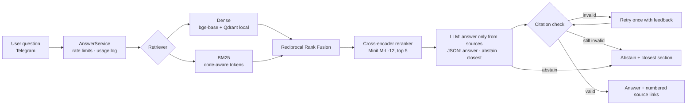

# Uniswap Docs Assistant — an evaluated, hallucination-aware RAG bot

Ask a question about the Uniswap developer docs in Telegram and get a short answer with
links to the exact doc sections it came from. If the docs don't cover the question, it
says so and points you to the closest section instead of guessing.

The point of this repo is the evidence: every quality number below comes from a
reproducible evaluation harness, and the same pipeline can be pointed at another
protocol's docs by changing one config file.

**Live demo:** [@Uniswapdocsqabot](https://t.me/Uniswapdocsqabot) on Telegram ·
**Walkthrough:** [docs/demo-script.md](docs/demo-script.md)

## Results

On 80 held-out test questions, the full system (hybrid search + reranker + grounded prompt)
fully answered 48 of the 57 answerable questions (84%), declined **all 23** questions the docs
don't answer, and 0.8% of the claims in its answers were unsupported by the retrieved docs,
against 5.0% for a naive "use the context" RAG setup. Retrieval gains over plain embedding search are statistically
clear; on this question set, the end-to-end quality and hallucination gaps point the same
way but are not statistically significant (details below the table).

Configurations (same generator `qwen-3.8-27b`, same 5 retrieved chunks):

| Configuration | Retrieval | Answer prompt | Citation check |
|---|---|---|---|
| `naive_rag` | dense only | generic "use the context to answer" | off |
| `baseline_dense` | dense only | grounded (`answer_v2`) | on |
| `hybrid` | dense + BM25, RRF | grounded | on |
| `hybrid_rerank` (**shipped**) | dense + BM25, RRF, cross-encoder | grounded | on |
| `hybrid_rerank_no_citecheck` | as shipped | grounded | off |

<!-- results:start (generated by `rag report --update-readme`; do not edit) -->
Run `run-8726a14b6f` · split `test` · 95% bootstrap CIs in brackets.

| Configuration | Hit@5 | MRR@10 | Answer correctness | Hallucination rate (claims) | Correct abstention (unanswerable) | False abstention (answerable) | Citation validity | Latency p50 / p95 | Tokens/q |
|---|---|---|---|---|---|---|---|---|---|
| `baseline_dense` | 84.2% [74%, 93%] | 65.4% [55%, 75%] | 83.0% [73%, 91%] | 0.8% (1/132) | 100.0% [100%, 100%] | 8.8% [2%, 16%] | 100.0% [100%, 100%] | 0.9s / 1.7s | 1607 |
| `hybrid` | 89.5% [81%, 96%] | 76.1% [66%, 85%] | 83.3% [74%, 92%] | 4.8% (7/145) | 95.7% [87%, 100%] | 7.0% [2%, 14%] | 100.0% [100%, 100%] | 0.8s / 1.4s | 1626 |
| `hybrid_rerank` | 86.0% [75%, 95%] | 77.6% [68%, 87%] | 86.8% [77%, 95%] | 0.8% (1/122) | 100.0% [100%, 100%] | 10.5% [4%, 19%] | 100.0% [100%, 100%] | 2.8s / 3.6s | 1590 |
| `hybrid_rerank_no_citecheck` | 86.0% [75%, 95%] | 77.6% [68%, 87%] | 86.8% [77%, 95%] | 0.8% (1/122) | 100.0% [100%, 100%] | 10.5% [4%, 19%] | 100.0% [100%, 100%] | 2.9s / 3.7s | 1590 |
| `naive_rag` | 84.2% [74%, 93%] | 65.4% [55%, 75%] | 82.5% [73%, 91%] | 5.0% (6/121) | 95.7% [87%, 100%] | 8.8% [2%, 18%] | n/a | 0.8s / 1.1s | 1276 |
<!-- results:end -->

How to read it:
- **Hallucination rate** = share of atomic claims in answers that the judge could not find
  in the retrieved context (lower is better). Abstentions make no claims.
- **Correct abstention** = on the 23 test questions the docs don't answer (unanswerable or
  about another protocol), how often the bot declines. **False abstention** = on the 57
  answerable ones, how often it wrongly declines.
- **Citation validity** = answers that cite at least one source and only sources that were
  actually retrieved (n/a for the naive prompt, which asks for no citations).
- Brackets are 95% bootstrap confidence intervals. Every number traces to per-question
  records in [`eval/runs/run-8726a14b6f/`](eval/runs/run-8726a14b6f/).
- Latency was measured on the evaluation machine with Cerebras-served models. The live bot
  runs on a shared 1-CPU VPS with Groq; its first real questions took 4.8–5.1 s end to end
  (about 4 s of that is retrieval on the single CPU core).

What the numbers say:
- **Retrieval improvements are real.** MRR@10 rises from 65.4% (dense) to 76.1% (hybrid,
  paired difference +10.7 pts, 95% CI [+3.8, +18.5]) and 77.6% (+ reranker, +12.2 pts,
  CI [+4.7, +20.4]).
- **The grounded prompt does most of the anti-hallucination work.** The naive setup made 6
  unsupported claims in 4 answers, including a confident invented answer to an
  unanswerable question; the shipped system made 1. With 80 questions, the paired
  difference in answers containing an unsupported claim (−4 pts, CI [−12, +4]) is not
  significant, because this generator rarely hallucinates even with a naive prompt.
- **The improved configuration does not beat `baseline_dense` on hallucination** (both 0.8%).
  They share the grounded prompt and citation check; better retrieval mainly improves
  ranking and answer correctness (+3.6 pts, not significant).
- **`hybrid` has a higher hallucination rate (4.8%) because of one question**: asked for a
  tick-accumulator value, the model worked out 500 by itself instead of quoting the docs'
  (imprecise) 50, which produced 5 of its 7 unsupported claims.
- **The citation check never triggered** on this test set (0 retries; every answer was valid
  on the first try), so on/off are identical. It remains as a safety net.
- **The shipped system wrongly declined 6 of 57 answerable questions.** Three were retrieval
  misses, all contract-address lookups: the docs contain near-identical deployment tables for
  dozens of chains, which is the main retrieval weakness. Two were false-premise questions the
  model declined instead of correcting, and one was a multi-section question whose sources
  were retrieved.

## How it works



An optional retrieval-score gate (abstain before calling the LLM) exists in the code but is
off: tuned on the dev split it added nothing, and an out-of-sample check on test showed it
would have hurt ([docs/abstention-threshold.md](docs/abstention-threshold.md)).

Ingestion: pinned docs snapshot (`git` commit + sha256 manifest) → MDX normalised to
Markdown → structure-aware chunks (never split inside code blocks or tables) → cached
embeddings → Qdrant (embedded mode) + BM25.

## Run it

Requirements: Python 3.11+, [uv](https://docs.astral.sh/uv/), a free LLM API key
([Groq](https://console.groq.com) or [Cerebras](https://cloud.cerebras.ai)); a Telegram bot
token for the bot. Everything else (embeddings, BM25, reranker, vector store) runs locally.

```bash
uv sync
cp .env.example .env     # add an API key (and TELEGRAM_BOT_TOKEN for the bot)
uv run rag ingest        # fetch the pinned docs (verified by sha256), chunk, embed, index
uv run rag eval --wait-on-quota   # full evaluation, resumable; writes eval/runs/<run>/
uv run rag bot           # start the Telegram bot
uv run pytest            # tests
```

The reported run used `LLM_PROVIDER=cerebras`, `GENERATOR_MODEL=qwen-3.8-27b`,
`GENERATOR_REASONING_EFFORT=none`, `JUDGE_MODEL=gpt-oss-120b`; its exact configuration is in
[`fingerprint.json`](eval/runs/run-8726a14b6f/fingerprint.json). The live bot serves the same
generator model through Groq. On free tiers a full run takes about 2 hours on Cerebras
(about 3 days on Groq's 200K tokens/day).

Deployment on a small VPS (systemd) or with Docker: [docs/deploy.md](docs/deploy.md).

Point it at another protocol: copy `config/uniswap.yaml`, change the `corpus` block (repo,
commit, folders, published URL pattern) and `generation.protocol_name`, then run with
`--config config/<protocol>.yaml`.

## Design decisions

**Structure-aware chunking, sized by experiment.** Docs are MDX; components are rewritten
to Markdown and the chunker works on the parsed Markdown, so a code block or table is never
cut in half (oversized tables are split by rows with the header repeated). Chunk size was
chosen by a 60-question probe experiment, not a guess: no size was *statistically* better at
retrieval, so I picked 256 tokens because it matched or beat 512 on every metric while
sending ~30% fewer context tokens per question. Details: [docs/experiments/chunk_size.md](docs/experiments/chunk_size.md).

**Hybrid retrieval with a reranker.** Docs questions mix concepts ("how do hooks get
permission?") with exact identifiers (`PoolManager.initialize`, `sqrtPriceX96`). Dense
embeddings handle the first, BM25 with a code-aware tokenizer the second, and Reciprocal
Rank Fusion combines them without score calibration. A cross-encoder then reorders the
fused candidates. On the probe set each step improved MRR@10 with a 95% CI above zero
(0.727 → 0.833 → 0.887). Details: [docs/experiments/retrieval.md](docs/experiments/retrieval.md).

**A small reranker on purpose.** `bge-reranker-base` took 12–25 s per query on CPU.
`ms-marco-MiniLM-L-12-v2` was statistically indistinguishable in quality at ~3.5 s, which is
what makes a live bot on a 1-CPU VPS possible.

**Abstention is a feature with three layers.** (1) The model must fill an explicit `abstain`
field and name the closest source; abstention is never inferred from wording. (2) A
citation check rejects answers that cite sources that were not retrieved or cite nothing,
retries once with feedback, then turns the answer into an abstention. (3) An optional
retrieval-score gate, tuned on the dev split only; on dev the model alone already declined
every should-decline question, so the gate is off ([docs/abstention-threshold.md](docs/abstention-threshold.md)).

**Labels that survive re-chunking.** Eval questions are labelled with verbatim evidence
quotes, resolved to chunk ids at eval time, so changing the chunker never invalidates the
test set. Answers are judged by a different model family than the one that generates them,
and every run is saved with a fingerprint of its full configuration.

**Built for free-tier APIs.** Groq's free tier allows 200K tokens/day per model. All LLM
calls go through a persistent cache (re-scoring a finished run is free and the "citation
check off" configuration reuses the first attempts of the "on" run), and the runner sleeps
through daily quota resets and resumes.

### What did not work

- **Gemini free tier**: 20 requests/day per model, unusable for an eval of ~1,000 calls.
- **Answer prompt v1** abstained on false premises even while stating the correct fact;
  v2 makes "contradicted premise → answer with a cited correction" explicit.
- **Requiring a citation on every sentence** turned correct corrections ("The premise is
  incorrect. ...") into abstentions through the retry path. It is now measured, not enforced.
- **Merging small sections** into one chunk did not improve retrieval and is disabled.
- **`bge-reranker-base`** was too slow on CPU (see above).
- **Judge v1** marked correct answers "partial" for omitting reference details the question
  never asked for; v2 defines key facts by the question.
- **Lower judge reasoning effort** halved judge tokens with identical grades on a 4-answer
  check, but missed one unsupported claim. Faithfulness is the core metric, so it was rejected.
- **LLM-drafted eval questions** needed heavy curation: 39 of 138 drafts were dropped and 8
  rewritten (plus 10 hand-written questions), mostly
  questions about values in example code and "unanswerable" questions that were trivially out
  of scope ([eval/curation.yaml](eval/curation.yaml)).

## Limitations

- **Small test set.** 80 test questions give wide confidence intervals; only the retrieval
  gains are statistically significant. Treat the end-to-end differences as directional.
- **Who wrote and checked the questions.** The 109 questions (29 dev / 80 test) were drafted
  by an LLM (`gpt-oss-120b`, not the generator) and then curated: 39 of 138 drafts dropped, 8
  rewritten, 10 written by hand ([eval/curation.yaml](eval/curation.yaml)). The review was done
  by an AI assistant (Claude) checking every reference against the source pages, **not by a
  Uniswap domain expert**. At least one "unanswerable" label is debatable: for q098 ("does the v3
  Swap event emit a slippage field?") the `hybrid` run answered "no" with supported claims.
- **LLM judge.** Correctness and faithfulness are graded by `gpt-oss-120b` with a fixed rubric
  ([prompts/judge_v2.md](prompts/judge_v2.md)), from a different model family than the generator.
  Known failure modes seen in the records: it occasionally counts a statement like "the docs
  do not explain X" as an unsupported claim (q005), and it judges faithfulness strictly against
  the retrieved text, so a mathematically correct answer that departs from imprecise docs
  counts as unsupported (q081). Judge agreement with a spot check of 20 decisions:
  <!-- judge-agreement -->pending<!-- /judge-agreement -->.
- **Serving differences.** The reported run used Cerebras-hosted models; the live bot uses the
  same generator model on Groq. Same weights and prompt, but providers can differ slightly.
- **Retrieval weak spot.** Contract-address lookups across near-identical per-chain deployment
  tables cause most retrieval misses.
- **Scope.** Single-turn English Q&A over a pinned docs snapshot (Uniswap/docs @ `1c7597d`);
  answers can go stale until the snapshot is updated (`rag fetch` + `rag ingest`).

## Repository map

| Path | What |
|---|---|
| `src/docrag/ingest/` | MDX normalisation, structure-aware chunker |
| `src/docrag/retrieval/` | embedder + cache, Qdrant store, BM25, RRF, reranker, retriever |
| `src/docrag/generation/` | prompt, citation checker, assistant (abstention logic) |
| `src/docrag/eval/` | question set, drafting, judge, runner, metrics, report |
| `src/docrag/service.py`, `src/docrag/bot/` | transport-agnostic service, Telegram adapter |
| `prompts/` | versioned prompt templates (answer, judge) |
| `config/uniswap.yaml` | corpus + pipeline configuration |
| `eval/questions.jsonl` | the evaluation set (dev / test splits) |
| `eval/runs/` | raw outputs of every evaluation run |
| `docs/experiments/` | chunk-size and retrieval experiments |
